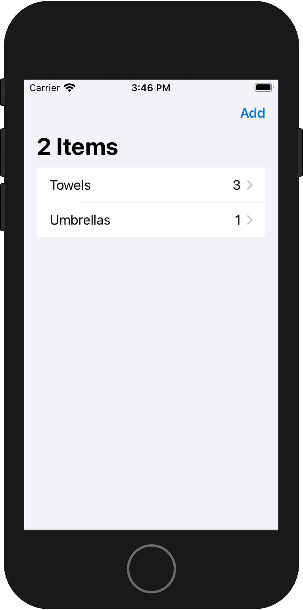

# GRDB

## Schritt 1: Zunächst eine möglichst minimale App mit GRDB

### Aufgabe

Wir benutzen GRDB als SQLite-Wrapper und erstellen eine möglichst simple App: Die Datenbank soll aus einer Liste von Items bestehen. Jedes `Item` besteht aus einem Namen (`name`) und optional aus seiner Anzahl (`quantity`). Der Button *New* erstellt ein neues Item mit einem zufälligen Namen und einer zufälligen Anzahl. Durch ein Wischen nach links können Items aus der Liste gelöscht werden.

<a><a>

### Ausführung

<a><a>

*GRDBSmallApp.swift:*

Das Eintritts-View nennen wir `ItemListView`. Sein korrespondierendes ViewModel nennen wir `ItemListModel`, das pro Szene mit dem Singleton einer Datenbank-Struktur `AppDatabase` initialisiert wird.

```swift
import SwiftUI

@main
struct GRDBSmallApp: App {
    let appDatabase = AppDatabase.shared
    
    var body: some Scene {
        WindowGroup {
            ItemListView(itemListModel: ItemListModel(database: appDatabase))
        }
    }
}
```

*AppDatabase.swift:*

```swift
import GRDB
import Combine

struct AppDatabase {
    private let databaseWriter: DatabaseWriter
    
    init(_ databaseWriter: DatabaseWriter) throws {
        self.databaseWriter = databaseWriter
        try migrator.migrate(databaseWriter)
    }
    
    private var migrator: DatabaseMigrator {
        var migrator = DatabaseMigrator()
        #if DEBUG
        migrator.eraseDatabaseOnSchemaChange = true
        #endif
        migrator.registerMigration("createItem") { database in
            try database.create(table: "item") { tableDefinition in
                tableDefinition.autoIncrementedPrimaryKey("id")
                tableDefinition.column("name", .text).notNull()
                tableDefinition.column("quantity", .integer)
            }
        }
        return migrator
    }
}

extension AppDatabase {
    func saveItem(_ item: inout Item) throws {
        try databaseWriter.write { database in
            try item.save(database)
        }
    }
    
    func deleteItems(ids: [Int64]) throws {
        try databaseWriter.write { database in
            _ = try Item.deleteAll(database, keys: ids)
        }
    }
    
    func itemsPublisher() -> AnyPublisher<[Item], Error> {
        ValueObservation.tracking(Item.all().fetchAll)
            .publisher(in: databaseWriter)
            .eraseToAnyPublisher()
    }
}
```

Der `DatabaseWriter` kümmert sich um das Schreiben der Datenbank auf Dateiebene. Wir werden später in *Persistence.swift* zwei verschiedene `DatabaseWriter` erstellen: Einen der seine Daten tatsächlich dauerhaft in einer Datei speichert und einen, der die Daten nur temporär im Arbeitsspeicher ablegt und der sich damit für Previews eignet.

Der `DatabaseMigrator` erstellt unsere Datenbank-Tabelle und könnte später unsere Datenbank migrieren, wenn wir uns entschließen die Datenbank zu ändern.

Die Methoden `saveItem` und `deleteItems` delegieren ihre Schreibvorgänge an die `Item`-Objekte.

Die Methode `itemsPublisher` ist das eigentliche Herzstück unserer Datenbank. Es erstellt einen Publisher, der mit `ValueObservation.tracking` Änderungen an `Item`-Objekten in der Datenbank überwacht und diese an seine Subscriber übermittelt. Unser `ItemListModel` benutzt einen solchen Subscriber um seine Liste aus `Item`-Objekten auf dem aktuellen Stand zu halten. Eine ausführlichere Deklaration von `itemsPublisher` wäre:

```swift
func itemsPublisher() -> AnyPublisher<[Item], Error> {
    let valueObservation = ValueObservation.tracking
    { (database: Database) throws -> [Item] in
        try Item.all().fetchAll(database)
    }
    return valueObservation.publisher(in: databaseWriter)
        .eraseToAnyPublisher()
}
```

`valueObservation` ist dabei ein Objekt, das dem Closure Zugriff auf eine Datenbank gibt. Im Closure erstellt die `fetchAll`-Funktion ein Array aus sämtlichen *Items*, die in der Datenbank gefunden werden. `valueObservation` kann nun dieses Array überwachen. Den Zugriff auf die Datenbank bekommt `valueObservation` aber erst im nächsten Schritt: Hier wird das Closure mit `databaseWriter` verknüpft und ergibt einen *Publisher*. [swift-memos 004](https://github.com/wurzelsand/swift-memos/blob/main/004%20ValueObservation%20aus%20GRDB%20verstehen.md)

*Persistence.swift:*

```swift
import GRDB

extension AppDatabase {
    static let shared = makeShared()
    
    private static func makeShared() -> AppDatabase {
        do {
            let url = try FileManager.default.url(
                for: .applicationSupportDirectory,
                in: .userDomainMask,
                appropriateFor: nil,
                create: true)
                .appendingPathComponent("db.sqlite")
            let databasePool = try DatabasePool(path: url.path)
            let appDatabase = try AppDatabase(databasePool)
            return appDatabase
        } catch {
            fatalError("Unresolved error \(error)")
        }
    }
    
    static func empty() throws -> AppDatabase {
        let dbQueue = DatabaseQueue()
        return try AppDatabase(dbQueue)
    }
}
```

`shared` ist das Singleton von `AppDatabase`, welches die Daten seiner Datenbank in einer Datei dauerhaft speichert. `empty` ist eigentlich nur ein leerer `AppDatabase`-Platzhalter für Previews.

*Item.swift:*

```swift
import GRDB

struct Item: Identifiable {
    var id: Int64?
    var name: String
    var quantity: Int?
}

extension Item {
    static func new() -> Item {
        Item(id: nil, name: "", quantity: nil)
    }
}

extension Item: Codable, FetchableRecord, MutablePersistableRecord {
    mutating func didInsert(with rowID: Int64, for column: String?) {
        id = rowID
    }
}

extension Item: CustomStringConvertible {
    var description: String {
        "id: \(id.map { String($0) } ?? "nil"), " +
        "name: \(name), " +
        "quantity: \(quantity.map { String($0) } ?? "nil")"
    }
}
```

Die drei Eigenschaften `id`, `name` und `quantity` entsprechen den gleichlautenden Feldern der SQLite-Datenbank. `id` ist ein *Optional*, da es sich als `autoIncrementedPrimaryKey` selbst organisiert und von uns nur mit `nil` initialisiert wird.

Die entscheidende *Extension* ist das Erfüllen der Protokolle `Codable`, `FetchableRecord` und `MutablePersistableRecord`.
* `Codable`: Damit sich die *Items* in eine externe Represäntation umwandeln und sich auch wieder selbst herstellen können.
* `FetchableRecord`: Damit das Ergebnis von `Item.all()` (siehe *AppDatabase.swift*) eine *Extension* mit der Methode `fetchAll` erhält. Der Rückgabetyp von `Item.all()` erfüllt nämlich u. a. das `FetchRequest`-Protokoll. Dessen `fetchAll`-*Extension* ist an eine Bedingung geknüpft:

    ```swift
    extension FetchRequest where Self.RowDecoder : GRDB.FetchableRecord {
        public func fetchAll(_ db: GRDB.Database) throws -> [Self.RowDecoder]
        ...
    }
    ```

* `MutablePersistableRecord`: `Item` erhält damit u. a. die Methoden `save`, `deleteAll` und `all`. Das Protokoll deklariert außerdem die Methode `didInsert`, die immer aufgerufen wird, wenn eine Zeile erfolgreich in die Datenbank eingefügt wurde. Seine Default-Implementierung, die vermutlich aus einem leeren Rumpf besteht, ersetzen wir durch eine eigene Implementierung.

*ItemListModel.swift:*

```swift
import GRDB
import Combine

class ItemListModel: ObservableObject {
    @Published var itemList = [Item]()
    private let database: AppDatabase
    private var itemsTracker: AnyCancellable?
    
    init(database: AppDatabase) {
        self.database = database
        itemsTracker = database.itemsPublisher().catch { error in
            Just<[Item]>([])
        }.sink { [weak self] items in
            self?.itemList = items
        }
    }
    
    func deleteItems(atOffsets offsets: IndexSet) throws {
        let userIDs = offsets.compactMap { itemList[$0].id }
        try database.deleteItems(ids: userIDs)
    }
    
    func newRandomItem() throws {
        func randomString() -> String {
            let letters = "abcdefghijklmnopqrstuvwxyz"
            return String((0..<7).map { _ in letters.randomElement()! })
        }
        
        var item = Item.init(id: nil,
                             name: randomString().capitalized,
                             quantity: Int.random(in: 1...9))
        try database.saveItem(&item)
    }
}
```

`database.itemsPublisher().catch` ist ein *Publisher*: Falls `itemsPublisher` einen Fehler sendet, veröffentlicht `catch` ein leeres *Array* aus *Items*. Ansonsten veröffentlicht `catch` das *Array* aus *Items*, welches es von `itemsPublisher` erhält. Mit `sink` haben wir auch gleich den Empfänger: Das *Closure* von `sink` sorgt dafür, dass nach jeder Veröffentlichung `itemList` aktualisiert wird. Da `itemList` selbst ein *Publisher* ist, werden alle Views, die auf `itemList` verweisen, aktualisiert. Das `itemsTracker`-*Cancellable* sorgt für die Lebensdauer des `sink`-*Closures*. 

*ItemListView.swift:*

```swift
import SwiftUI

struct ItemListView: View {
    @ObservedObject var itemListModel: ItemListModel
    
    var body: some View {
        VStack {
            Button("New") {
                try! itemListModel.newRandomItem()
            }
            List {
                ForEach(itemListModel.itemList) { item in
                    Text(String(describing: item))
                }.onDelete { indexSet in
                    try! itemListModel.deleteItems(atOffsets: indexSet)
                }
            }
        }
    }
}

struct ContentView_Previews: PreviewProvider {
    static var previews: some View {
        ItemListView(itemListModel: ItemListModel(database: try! .empty()))
    }
}
```

## Schritt 2: Items in neuem Fenster erstellen

### Aufgabe

<a><a>

### Ausführung

Neue Dateien: *ItemEditorModel.swift* und *ItemEditorView.swift*

<a></a>


*ItemEditorModel.swift:*

```swift
import Combine

class ItemEditorModel: ObservableObject {
    @Published var nameEdit = ""
    @Published var quantityEdit = ""
    
    private let database: AppDatabase
    var item: Item
    
    init(database: AppDatabase, item: Item) {
        self.database = database
        self.item = item
    }
    
    func saveItem() throws {
        // quantityEdit empty => item.quantity becomes nil
        if !nameEdit.isEmpty {
            item.name = nameEdit
            item.quantity = Int(quantityEdit)
        }
        if !item.isEmpty {
            try database.saveItem(&item)
        }
    }
}
```

*ItemListModel:*

<pre>
import GRDB
import Combine

class ItemListModel: ObservableObject {
    @Published var itemList = [Item]()
    private let database: AppDatabase
    private var itemsTracker: AnyCancellable?
    
    init(database: AppDatabase) {
        self.database = database
        itemsTracker = database.itemsPublisher().catch { error in
            Just<[Item]>([])
        }.sink { [weak self] items in
            self?.itemList = items
        }
    }
    
    func deleteItems(atOffsets offsets: IndexSet) throws {
        let userIDs = offsets.compactMap { itemList[$0].id }
        try database.deleteItems(ids: userIDs)
    }
    
    <b>func newItemEditorModel(for item: Item) -> ItemEditorModel {
        ItemEditorModel(database: database, item: item)
    }</b>
    
<b>//    <s>func newRandomItem() throws {</s></b>
}
</pre>

Wir benötigen `newEditorModel` damit wir aus `ItemListModel` ein `ItemEditorModel` erstellen können. Denn nur `ItemListModel` besitzt einen Verweis auf das `AppDatabase`-Singleton mit dem sich `ItemEditorModel` initialisieren lässt.

*Item.swift*

<pre>
import GRDB

struct Item: Identifiable {
    var id: Int64?
    var name: String
    var quantity: Int?
}

extension Item {
    static func new() -> Item {
        Item(id: nil, name: "", quantity: nil)
    }
    
    <b>var isEmpty: Bool {
        name.isEmpty && quantity == nil
    }</b>
}

extension Item: Codable, FetchableRecord, MutablePersistableRecord {
    mutating func didInsert(with rowID: Int64, for column: String?) {
        id = rowID
    }
}

<b>//extension Item: CustomStringConvertible {</b>
</pre>

*ItemListView.swift:*

<pre>
import SwiftUI

struct ItemListView: View {
    @ObservedObject var itemListModel: ItemListModel
    <b>@State private var newItemSheet = false</b>
    
    var body: some View {
        <b>NavigationView {</b>
            List {
                ForEach(itemListModel.itemList) { item in
                    <b>ItemRow(item: item)</b>
                }.onDelete { indexSet in
                    try! itemListModel.deleteItems(atOffsets: indexSet)
                }
            }
            <b>.navigationBarTitle(Text("\(itemListModel.itemList.count) Items"))
            .navigationBarItems(trailing: Button("Add") {
                newItemSheet = true
            }).sheet(isPresented: $newItemSheet, content: {
                ItemEditorView(
                    itemEditorModel: itemListModel.newItemEditorModel(
                        for: .new()),
                    dismissAction: { newItemSheet = false })
            })
        }</b>
    }
}

<b>struct ItemRow: View {
    var item: Item
    
    var body: some View {
        HStack {
            Text(item.name)
            Spacer()
            Text(item.quantity.map { String($0) } ?? "")
        }
    }
}</b>

struct ContentView_Previews: PreviewProvider {
    static var previews: some View {
        ItemListView(itemListModel: ItemListModel(database: try! .empty()))
    }
}
</pre>

*ItemEditorView.swift:*

```swift
import SwiftUI

struct ItemEditorView: View {
    @ObservedObject var itemEditorModel: ItemEditorModel
    let dismissAction: () -> Void
    
    var body: some View {
        NavigationView {
            List {
                TextField("Name", text: $itemEditorModel.nameEdit)
                TextField("Quantity", text: $itemEditorModel.quantityEdit)
            }
            .listStyle(GroupedListStyle())
            .navigationBarTitle("New Item")
            .navigationBarItems(leading: Button("Cancel") {
                dismissAction()
            }, trailing: Button("Save") {
                try! saveAndExit()
            })
        }
    }
    
    private func saveAndExit() throws {
        try itemEditorModel.saveItem()
        dismissAction()
    }
}

struct ItemEditorView_Previews: PreviewProvider {
    static var previews: some View {
        ItemEditorView(
            itemEditorModel: ItemEditorModel(
                database: try! .empty(), item: .new()),
            dismissAction: {})
    }
}
```

## Schritt 3: Items bearbeitbar machen

### Aufgabe



### Ausführung

*ItemEditorModel.swift:*

<pre>
import Combine

class ItemEditorModel: ObservableObject {
    @Published var nameEdit = ""
    @Published var quantityEdit = ""
    
    private let database: AppDatabase
    var item: Item
    
    init(database: AppDatabase, item: Item) {
        self.database = database
        self.item = item
        <b>if !item.name.isEmpty {
            nameEdit = item.name
            if let quantity = item.quantity {
                quantityEdit = String(quantity)
            }
        }</b>
    }
    
    func saveItem() throws {
        // quantityEdit empty => item.quantity becomes nil
        if !nameEdit.isEmpty {
            item.name = nameEdit
            item.quantity = Int(quantityEdit)
        }
        if !item.isEmpty {
            try database.saveItem(&item)
        }
    }
}
</pre>

*ItemListView.swift:*

<pre>
import SwiftUI

struct ItemListView: View {
    @ObservedObject var itemListModel: ItemListModel
    @State private var newItemSheet = false
    
    var body: some View {
        NavigationView {
            List {
                ForEach(itemListModel.itemList) { item in
                    <b>NavigationLink(
                        destination: EditItemView(
                            itemEditorModel: itemListModel.newItemEditorModel(for: item)),
                        label: { ItemRow(item: item) })</b>
                }.onDelete { indexSet in
                    try! itemListModel.deleteItems(atOffsets: indexSet)
                }
            }
            .navigationBarTitle(Text("\(itemListModel.itemList.count) Items"))
            .navigationBarItems(trailing: Button("Add") {
                newItemSheet = true
            }).sheet(isPresented: $newItemSheet, content: {
                <b>CreateItemView(
                    itemEditorModel: itemListModel.newItemEditorModel(for: .new()),
                    dismissAction: { newItemSheet = false})</b>
            })
        }
    }
}

struct ItemRow: View {
    var item: Item
    
    var body: some View {
        HStack {
            Text(item.name)
            Spacer()
            Text(item.quantity.map { String($0) } ?? "")
        }
    }
}

struct ContentView_Previews: PreviewProvider {
    static var previews: some View {
        ItemListView(itemListModel: ItemListModel(database: try! .empty()))
    }
}
</pre>

*ItemEditorView.swift:*

<pre>
import SwiftUI

struct ItemEditorView: View {
    @ObservedObject var itemEditorModel: ItemEditorModel
    <b>//...</b>
    
    var body: some View {
        List {
            TextField("Name", text: $itemEditorModel.nameEdit)
            TextField("Quantity", text: $itemEditorModel.quantityEdit)
        }
        .listStyle(GroupedListStyle())
    }

}

<b>struct CreateItemView: View {
    @ObservedObject var itemEditorModel: ItemEditorModel
    let dismissAction: () -> Void
    
    var body: some View {
        NavigationView {
            ItemEditorView(itemEditorModel: itemEditorModel)
                .navigationBarTitle("New Item")
                .navigationBarItems(leading: Button("Cancel") {
                    dismissAction()
                }, trailing: Button("Save") {
                    try! saveAndExit()
                })
        }
    }
    
    private func saveAndExit() throws {
        try itemEditorModel.saveItem()
        dismissAction()
    }
}

struct EditItemView: View {
    @ObservedObject var itemEditorModel: ItemEditorModel
    
    var body: some View {
        NavigationView {
            ItemEditorView(itemEditorModel: itemEditorModel)
                .onDisappear {
                    try! itemEditorModel.saveItem()
                }
                .navigationBarTitle("Edit \(itemEditorModel.item.name)")
        }
    }
}</b>

struct ItemEditorView_Previews: PreviewProvider {
    static var previews: some View {
        ItemEditorView(
            itemEditorModel: ItemEditorModel(
                <b>database: try! .empty(), item: .new()))</b>
    }
}
</pre>

## Schritt 4: Sortierte Anzeige

### Aufgabe

<a></a>

### Ausführung

*AppDatabase.swift:*

<pre>
import GRDB
import Combine

struct AppDatabase {
    private let databaseWriter: DatabaseWriter
    
    init(_ databaseWriter: DatabaseWriter) throws {
        self.databaseWriter = databaseWriter
        try migrator.migrate(databaseWriter)
    }
    
    private var migrator: DatabaseMigrator {
        var migrator = DatabaseMigrator()
        #if DEBUG
        migrator.eraseDatabaseOnSchemaChange = true
        #endif
        migrator.registerMigration("createItem") { database in
            try database.create(table: "item") { tableDefinition in
                tableDefinition.autoIncrementedPrimaryKey("id")
                tableDefinition.column("name", .text).notNull()
                tableDefinition.column("quantity", .integer)
            }
        }
        return migrator
    }
}

extension AppDatabase {
    func saveItem(_ item: inout Item) throws {
        try databaseWriter.write { database in
            try item.save(database)
        }
    }
    
    func deleteItems(ids: [Int64]) throws {
        try databaseWriter.write { database in
            _ = try Item.deleteAll(database, keys: ids)
        }
    }
    
    <b>func itemsUnorderedPublisher() -> AnyPublisher<[Item], Error> {
        itemsPublisher(request: Item.all())
    }
    
    func itemsOrderedByNamePublisher() -> AnyPublisher<[Item], Error> {
        itemsPublisher(request: Item.all().orderedByName())
    }
    
    func itemsOrderedByNameReversedPublisher() -> AnyPublisher<[Item], Error> {
        itemsPublisher(request: Item.all().orderedByNameReversed())
    }
    
    private func itemsPublisher(request: QueryInterfaceRequest<Item>)
    -> AnyPublisher<[Item], Error> {
        ValueObservation.tracking(request.fetchAll)
            .publisher(in: databaseWriter)
            .eraseToAnyPublisher()
    }</b>
}
</pre>

*Item.swift:*

<pre>
import GRDB

struct Item: Identifiable {
    var id: Int64?
    var name: String
    var quantity: Int?
}

extension Item {
    static func new() -> Item {
        Item(id: nil, name: "", quantity: nil)
    }
    
    var isEmpty: Bool {
        name.isEmpty && quantity == nil
    }
}

extension Item: Codable, FetchableRecord, MutablePersistableRecord {
    <b>fileprivate enum Columns {
        static let name = Column(Item.CodingKeys.name)
        static let quantity = Column(Item.CodingKeys.quantity)
    }</b>
    
    mutating func didInsert(with rowID: Int64, for column: String?) {
        id = rowID
    }
}

<b>extension DerivableRequest where RowDecoder == Item {
    func orderedByName() -> Self {
        order(Item.Columns.name)
    }
    
    func orderedByNameReversed() -> Self {
        order(Item.Columns.name).reversed()
    }
}</b>
</pre>

*ItemListModel.swift:*

<pre>
import GRDB
import Combine

class ItemListModel: ObservableObject {
    <b>enum Ordering: String, CaseIterable {
        case unspecified = "Unspecified"
        case ascending = "Ascending"
        case descending = "Descending"
    }</b>
    
    @Published var itemList = [Item]()
    <b>@Published var ordering: Ordering = .unspecified</b>
    private let database: AppDatabase
    private var itemsTracker: AnyCancellable?
    
    init(database: AppDatabase) {
        self.database = database
        <b>itemsTracker = itemsPublisher().sink { [weak self] items in
            self?.itemList = items
        }</b>
    }
    
    func deleteItems(atOffsets offsets: IndexSet) throws {
        let userIDs = offsets.compactMap { itemList[$0].id }
        try database.deleteItems(ids: userIDs)
    }
    
    func newItemEditorModel(for item: Item) -> ItemEditorModel {
        ItemEditorModel(database: database, item: item)
    }
    
    <b>func itemsPublisher() -> AnyPublisher<[Item], Never> {
        $ordering.map { ordering -> AnyPublisher<[Item], Error> in
            switch ordering {
            case .unspecified:
                return self.database.itemsUnorderedPublisher()
            case .ascending:
                return self.database.itemsOrderedByNamePublisher()
            case .descending:
                return self.database.itemsOrderedByNameReversedPublisher()

            }
        }.map { publisher in
            publisher.catch { failure in
                Just<[Item]>([])
            }
        }
        .switchToLatest()
        .eraseToAnyPublisher()
    }
    
    func nextOrdering() {
        let allCases = Ordering.allCases
        let index = allCases.firstIndex(of: ordering)!
        let indexNext = (index + 1) % allCases.count
        ordering = allCases[indexNext]
    }</b>
}
</pre>

*ItemListView.swift:*

<pre>
import SwiftUI

struct ItemListView: View {
    @ObservedObject var itemListModel: ItemListModel
    @State private var newItemSheet = false
    
    var body: some View {
        NavigationView {
            List {
                ForEach(itemListModel.itemList) { item in
                    NavigationLink(
                        destination: EditItemView(
                            itemEditorModel: itemListModel.newItemEditorModel(for: item)),
                        label: { ItemRow(item: item) })
                }.onDelete { indexSet in
                    try! itemListModel.deleteItems(atOffsets: indexSet)
                }
            }
            .navigationBarTitle(Text("\(itemListModel.itemList.count) Items"))
            <b>.navigationBarItems(
                leading: nextOrderingButton,
                trailing: Button("Add") {
                    newItemSheet = true
                }).sheet(isPresented: $newItemSheet, content: {
                    CreateItemView(
                        itemEditorModel: itemListModel.newItemEditorModel(for: .new()),
                        dismissAction: { newItemSheet = false})
                })
        }
    }
    
    var nextOrderingButton: some View {
        Button(itemListModel.ordering.rawValue) {
            itemListModel.nextOrdering()
        }
    }</b>
}

struct ItemRow: View {
    var item: Item
    
    var body: some View {
        HStack {
            Text(item.name)
            Spacer()
            Text(item.quantity.map { String($0) } ?? "")
        }
    }
}

struct ContentView_Previews: PreviewProvider {
    static var previews: some View {
        ItemListView(itemListModel: ItemListModel(database: try! .empty()))
    }
}
</pre>

## Migration: Neue Spalte in der Datenbank

### Aufgabe

Füge der Tabelle `item` in der Datenbank eine Spalte `notes` hinzu. `notes` soll eine Textspalte sein, in die bei der Migration die Werte von `name` kopiert werden.


### Ausführung

*AppDatabase.swift:*

<pre>
import GRDB
import Combine

struct AppDatabase {
    private let databaseWriter: DatabaseWriter
    
    init(_ databaseWriter: DatabaseWriter) throws {
        self.databaseWriter = databaseWriter
        try migrator.migrate(databaseWriter)
    }
    
    private var migrator: DatabaseMigrator {
        var migrator = DatabaseMigrator()
<b>//        #if DEBUG
//        migrator.eraseDatabaseOnSchemaChange = true
//        #endif</b>
        migrator.registerMigration("createItem") { database in
            try database.create(table: "item") { tableDefinition in
                tableDefinition.autoIncrementedPrimaryKey("id")
                tableDefinition.column("name", .text).notNull()
                tableDefinition.column("quantity", .integer)
            }
        }
        
        <b>migrator.registerMigration("addNotes") { database in
            try database.alter(table: "item") { table in
                table.add(column: "notes", .text)
            }
            try database.execute(sql: "UPDATE item SET notes = name")
        }</b>

        return migrator
    }
}

extension AppDatabase {
    func saveItem(_ item: inout Item) throws {
        try databaseWriter.write { database in
            try item.save(database)
        }
    }
    
    func deleteItems(ids: [Int64]) throws {
        try databaseWriter.write { database in
            _ = try Item.deleteAll(database, keys: ids)
        }
    }
    
    func itemsUnorderedPublisher() -> AnyPublisher<[Item], Error> {
        itemsPublisher(request: Item.all())
    }
    
    func itemsOrderedByNamePublisher() -> AnyPublisher<[Item], Error> {
        itemsPublisher(request: Item.all().orderedByName())
    }
    
    func itemsOrderedByNameReversedPublisher() -> AnyPublisher<[Item], Error> {
        itemsPublisher(request: Item.all().orderedByNameReversed())
    }
    
    private func itemsPublisher(request: QueryInterfaceRequest<Item>)
    -> AnyPublisher<[Item], Error> {
        ValueObservation.tracking(request.fetchAll)
            .publisher(in: databaseWriter)
            .eraseToAnyPublisher()
    }
}
</pre>

*Item.swift:*

<pre>
import GRDB

struct Item: Identifiable {
    var id: Int64?
    var name: String
    var quantity: Int?
    <b>var notes: String</b>
}

extension Item {
    static func new() -> Item {
        <b>Item(id: nil, name: "", quantity: nil, notes: "")</b>
    }
    
    var isEmpty: Bool {
        <b>name.isEmpty && notes.isEmpty && quantity == nil</b>
    }
}

extension Item: Codable, FetchableRecord, MutablePersistableRecord {
    fileprivate enum Columns {
        static let name = Column(Item.CodingKeys.name)
        static let quantity = Column(Item.CodingKeys.quantity)
        <b>static let notes = Column(Item.CodingKeys.notes)</b>
    }
    
    mutating func didInsert(with rowID: Int64, for column: String?) {
        id = rowID
    }
}

extension DerivableRequest where RowDecoder == Item {
    func orderedByName() -> Self {
        order(Item.Columns.name)
    }
    
    func orderedByNameReversed() -> Self {
        order(Item.Columns.name).reversed()
    }
}
</pre>

*ItemEditorModel.swift:*

<pre>
import Combine

class ItemEditorModel: ObservableObject {
    @Published var nameEdit = ""
    @Published var quantityEdit = ""
    <b>@Published var notesEdit = ""</b>
    
    private let database: AppDatabase
    var item: Item
    
    init(database: AppDatabase, item: Item) {
        self.database = database
        self.item = item
        if !item.name.isEmpty {
            nameEdit = item.name
            <b>notesEdit = item.notes</b>
            if let quantity = item.quantity {
                quantityEdit = String(quantity)
            }
        }
    }
    
    func saveItem() throws {
        // quantityEdit empty => item.quantity becomes nil
        if !nameEdit.isEmpty {
            item.name = nameEdit
            <b>item.notes = notesEdit</b>
            item.quantity = Int(quantityEdit)
        }
        if !item.isEmpty {
            try database.saveItem(&item)
        }
    }
}
</pre>

*ItemListView.swift:*

<pre>
import SwiftUI

struct ItemListView: View {
    @ObservedObject var itemListModel: ItemListModel
    @State private var newItemSheet = false
    
    var body: some View {
        NavigationView {
            List {
                ForEach(itemListModel.itemList) { item in
                    NavigationLink(
                        destination: EditItemView(
                            itemEditorModel: itemListModel.newItemEditorModel(for: item)),
                        label: { ItemRow(item: item) })
                }.onDelete { indexSet in
                    try! itemListModel.deleteItems(atOffsets: indexSet)
                }
            }
            .navigationBarTitle(Text("\(itemListModel.itemList.count) Items"))
            .navigationBarItems(
                leading: nextOrderingButton,
                trailing: Button("Add") {
                    newItemSheet = true
                }).sheet(isPresented: $newItemSheet, content: {
                    CreateItemView(
                        itemEditorModel: itemListModel.newItemEditorModel(for: .new()),
                        dismissAction: { newItemSheet = false})
                })
        }
    }
    
    var nextOrderingButton: some View {
        Button(itemListModel.ordering.rawValue) {
            itemListModel.nextOrdering()
        }
    }
}

struct ItemRow: View {
    var item: Item
    
    var body: some View {
        HStack {
            Text(item.name)
            Spacer()
            <b>Text(item.notes)
            Spacer()</b>
            Text(item.quantity.map { String($0) } ?? "")
        }
    }
}

struct ContentView_Previews: PreviewProvider {
    static var previews: some View {
        ItemListView(itemListModel: ItemListModel(database: try! .empty()))
    }
}
</pre>

*ItemEditorView.swift:*

<pre>
import SwiftUI

struct ItemEditorView: View {
    @ObservedObject var itemEditorModel: ItemEditorModel
    
    var body: some View {
        List {
            TextField("Name", text: $itemEditorModel.nameEdit)
            TextField("Quantity", text: $itemEditorModel.quantityEdit)
            <b>TextField("Notes", text: $itemEditorModel.notesEdit)</b>
        }
        .listStyle(GroupedListStyle())
    }

}

struct CreateItemView: View {
    @ObservedObject var itemEditorModel: ItemEditorModel
    let dismissAction: () -> Void
    
    var body: some View {
        NavigationView {
            ItemEditorView(itemEditorModel: itemEditorModel)
                .navigationBarTitle("New Item")
                .navigationBarItems(leading: Button("Cancel") {
                    dismissAction()
                }, trailing: Button("Save") {
                    try! saveAndExit()
                })
        }
    }
    
    private func saveAndExit() throws {
        try itemEditorModel.saveItem()
        dismissAction()
    }
}

struct EditItemView: View {
    @ObservedObject var itemEditorModel: ItemEditorModel
    
    var body: some View {
        NavigationView {
            ItemEditorView(itemEditorModel: itemEditorModel)
                .onDisappear {
                    try! itemEditorModel.saveItem()
                }
                .navigationBarTitle("Edit \(itemEditorModel.item.name)")
        }
    }
}

struct ItemEditorView_Previews: PreviewProvider {
    static var previews: some View {
        ItemEditorView(
            itemEditorModel: ItemEditorModel(
                database: try! .empty(), item: .new()))
    }
}
</pre>
